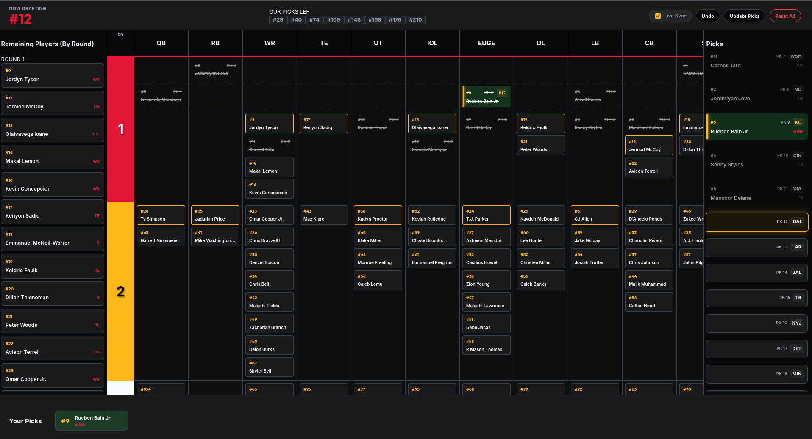

# 2026 NFL Draft Board

A high-performance, professional-grade visual board designed for tracking the 2026 NFL Draft. Originally built for the Kansas City Chiefs, the application is fully data-driven and can be configured for any team or draft board preference.



## Key Features

- **Dynamic Positional Board**: Visual 2D grid of players organized by positional columns and draft round horizontal slices.
- **Configurable Layout**: Fully customizable column order (QB, RB, WR...) via a simple text file.
- **Quick Draft Sidebar**: Rapidly mark players as drafted from the ranked list.
- **Live Sync (In Development)**: Support for real-time polling to automatically update the board as the live draft progresses.
- **Persistence**: All draft actions are saved to `localStorage`, ensuring your board stays consistent across refreshes.
- **Data Modularity**: Supports loading external big boards via URL parameters.

## Usage

### Browser Operations
1. **Draft a Player**: Click on any player card on the board or sidebars.
2. **Current Pick**: The active pick is highlighted with a gold border and glow.
3. **Picks Tracking**: The "OUR PICKS LEFT" tracker at the top shows remaining selections for your team.
4. **Undo**: Mistakenly drafted someone? Use the "Undo" button to revert the last action.
5. **Update Picks**: Modify your team's owned picks via the "Update Picks" modal.

### URL Parameters
- **Rankings Override**: Load a custom CSV by adding `?rankings=https://your-url.com/rankings.csv` to the URL.
  - *Note: External URLs must support CORS.*

## Data Formatting

The application is driven by three primary files in the `/public` directory:

### 1. `rankings.csv`
Defines the player pool and board layout.
- **Format**: `group,name,position`
- **Group Optionality**: The `group` field is only required for the *first* player in a new board row. Subsequent rows with empty group values will automatically inherit the last seen group.
- **Vertical Grouping**: The `group` value (e.g., `1.1`, `1.2`) creates a horizontal slice across the entire board, allowing you to group players by round or specific draft tier.

#### Creating Rankings with Excel
1. Open Excel and create three columns: `group`, `name`, and `position`.
2. Enter your player data. Use the `group` column sparingly to create row breaks.
3. Click **File > Save As**.
4. Choose **CSV (Comma delimited) (*.csv)** as the file format.
5. Save the file as `rankings.csv` and place it in the `public/` folder of the project.

### 2. `picks.txt`
A simple list of pick numbers owned by your team.
- **Format**: Comma-separated integers.
- **Example**: `32, 64, 95, 126`

### 3. `columns.txt`
Defines the order of positional columns from left to right.
- **Format**: Comma-separated list of positions.
- **Example**: `QB, RB, WR, TE, OT, IOL, EDGE, DL, LB, CB, S`

## Setup & Development

### Local Installation
```bash
# Install dependencies
npm install

# Run development server
npm run dev

# Build for production
npm run build
```

### Live Sync Modularity
The application features a robust discovery system. If the `src/services/` directory (containing synchronization logic) is missing, the "Live Sync" functionality will gracefully disable itself in the UI without affecting the core board experience.
