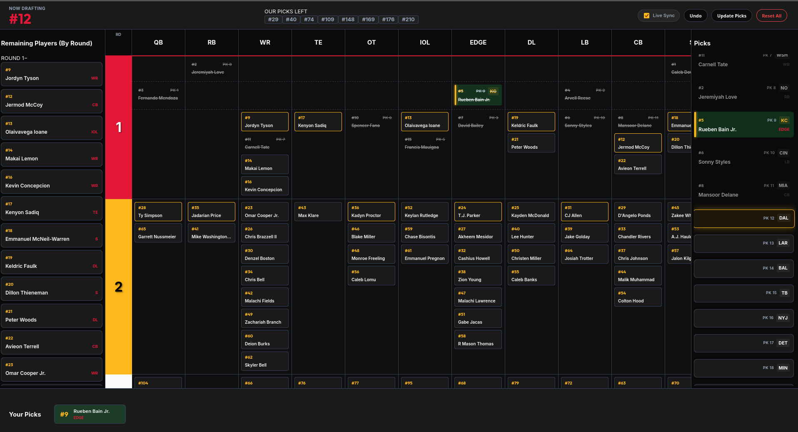

# DraftBoard

A five-stage NFL offseason tracker, built as a broadcast companion for RGR
Football. It runs entirely in the browser: no account, no server, no network
call after the page loads.



## The five stages

An offseason **starts** at free agency and **ends** at a 53-man roster, and the
app is laid out that way. Each tab is a stage, and each one feeds the next.

| stage | what it is for |
|---|---|
| 💰 **Free Agency** | candidates you are considering, per position row, against what the roster still needs |
| 🔎 **Scouting** | every analyst's board — tag, rank, annotate and compare players before the draft |
| 📋 **Draft Board** | the live board on air: position columns, round tiers, click to draft |
| 🪧 **UDFA** | who is left once the draft ends, and signing them |
| 🏈 **Roster** | the 53-man depth chart, seeded from the three stages above |

Two shapes do all five. Scouting, Draft and UDFA share the **board grid**
(position columns × round rows); Free Agency and Roster share the **depth
chart** (position rows × slots). They are real shared components, not copies.

**Seasons** stack: roll over to a new year and last season's roster becomes the
new free-agency pool, while the roster keeps its shape and loses its players.
Roll back and the old season is intact.

## What it stores, and where

Everything lives in the browser, as **documents in collections** — the shape a
document database uses, kept deliberately so that moving to a shared backend is
a change of adapter rather than a rewrite.

- Each collection is one localStorage key; the key *is* the path
  (`db_boards/{boardId}/entries`).
- Reads are synchronous, writes are asynchronous and queued: a refused write is
  retried with backoff, survives a reload, and is never silently dropped.
- A player has one **registry record** with a stable id. Names arrive from
  files and are resolved to that id **once**; everything downstream keys on the
  id, so correcting a spelling never orphans anybody's work.

`docs/STORAGE.md` has the full schema, the per-collection sizes, and what the
quota actually counts. Worth reading before adding a collection: **one season
is about 1MB against a 5MB quota**, so the browser holds roughly three to five
seasons before it refuses to save.

On the `firebase` branch, evaluations (an expert's strengths/weaknesses/notes)
are globally readable by design, independent of any board-level privacy —
they're keyed by author and span every board he's built. See
`docs/FIREBASE.md`.

## Getting your data in

The app ships with a worked 2026 class so it is usable immediately. Your own
data goes in through `public/`:

| file | what it is |
|---|---|
| `rankings_consensus.csv`, `rankings_dan.csv`, `rankings_ryan.csv` | one board per analyst — `group,name,position` |
| `picks.txt` | the pick numbers your team owns, comma-separated |
| `columns.txt` | positional column order, left to right |
| `DraftBoard_Picks.csv` | a completed draft, if you have one |
| `roster_2025_end.csv`, `roster_predraft.csv` | last season's roster shape, and free agency's starting pool |

In a rankings file the `group` column (`1.1`, `1.2`, …) starts a new row on
the board and is inherited by the rows beneath it, so you only set it when the
tier changes. Save as **CSV (comma delimited)** from any spreadsheet.

These files are an **import, not a source of truth**: they seed a season the
first time it is opened, and after that the season lives in storage and is read
from there. Adding players later goes through **Add Players**, which checks each
new name against everyone already known before creating a record.

## Tests

```sh
npm test                    # unit + browser
npm run test:unit           # vitest, ~500 tests, seconds
npm run test:browser        # playwright: drag, layout, modals, routing
npm run test:browser:docker # the same, pinned to the 1.55.0 image
```

The split is deliberate: anything that is a function of values is a unit test,
and the browser suite keeps only what a browser can prove — drag-and-drop,
clipping, stacking contexts, modals. `playwright.phone.config.js` runs specs at
390px with a real touchscreen — **38 of 47 pass**. It is not wired into
`npm test` because the nine that fail need device-aware handling (on a phone
the player card opens as a modal, so a spec clicking what would be the side
panel is blocked by it), not because the app is broken there.

## Branches

- **`pastel-lantern`** — this one. Local-only, no backend, no account.
- **`firebase`** — the same app plus a shared backend, so a viewer can follow
  an expert's board live. It is `pastel-lantern` plus that work and nothing
  else; see `docs/FIREBASE.md` on that branch.

## Options and saving

### URL Parameters
- **Live Sync Activation**: Add `?sync=true` to the URL to enable the Live Sync toggle in the Top Panel.
- **Board Selection**: `?board=<slug>` opens a named board — `?board=ryan`
  shows Ryan's rankings rather than the Consensus. The slug is the board's
  name, lowercased.
  - *Replaces the old `?rankings=<url>` override, which loaded a CSV straight
    off a URL. A board is now a thing the app owns — it has an id, an author
    and a season — so the board name is the switch, not the file behind it.
    The app strips `?rankings=` from any link that still carries it.*
- **Athletic Matrix Link**: `?matrixUrl=https://your-store.com/matrix` changes the
  "Get your Athletic Matrix copy here." link shown on scouting cards that carry
  matrix values. The value is remembered, so it only needs to be passed once.
  Only `http`/`https` URLs are accepted. It can also be set per deployment at
  build time with the `VITE_ATHLETIC_MATRIX_URL` environment variable.

### Saving your work

- **Per-stage CSVs** — each stage exports its own human-readable CSV (draft
  session, roster, FA candidates, scouting overlay, and a board-ready
  `group,name,position` rankings file). Found under each view's **More** menu,
  and the Right Panel's Save/Load Session buttons on the draft board.
- **Full session (JSON)** — the **Session** menu at the right of the tab bar
  exports *every* stage at once and restores it. Use this to move a whole
  offseason between machines; use the CSVs when you want to edit something in a
  spreadsheet or hand one stage to someone else.

## Setup & Development

### Prerequisites

The application requires **Node.js (LTS recommended)** and **npm**.


### Windows

1. Download Node.js: https://nodejs.org  
2. Use **PowerShell** or **Command Prompt**  
3. Verify installation:

    node -v  
    npm -v  


### macOS

1. Install Node.js from https://nodejs.org  
   or via Homebrew:

    brew install node  

2. Open **Terminal**  
3. Verify installation:

    node -v  
    npm -v  


### Linux (Ubuntu/Debian)

1. Install Node.js:

    sudo apt update  
    sudo apt install nodejs npm  

2. Open terminal  
3. Verify installation:

    node -v  
    npm -v  


### Local Installation

    git clone https://github.com/FBrand/DraftBoard.git  
    cd DraftBoard  
    npm install  

Alternatively: download ZIP from GitHub and extract it.


### Development Server

    npm run dev  

Open:

    http://localhost:5173  


### Production Build

    npm run build  

Creates a `dist/` folder with production files.


### Preview Production Build

    npm run preview  


### Deployment

The application is fully static and can be hosted on any web server or hosting platform.

1. Build the project:

    npm run build  

2. Upload the contents of the `dist/` folder to your hosting provider.

3. Ensure your server is configured for SPA routing (fallback to `index.html`).

The app runs entirely in the browser and requires no backend.

### Live Sync Modularity
The application features a robust discovery system. If the `src/services/` directory (containing synchronization logic) is missing, the "Live Sync" functionality will gracefully disable itself in the UI without affecting the core board experience.

## Legal

⚠️ Live Sync is provided strictly for experimental and educational purposes. It
may rely on publicly accessible, unofficial data sources and is not guaranteed
to be accurate, stable, or compliant with third-party terms.

**Use at your own risk.** Users are responsible for ensuring compliance with
applicable laws and terms. The authors assume no liability for any misuse or
resulting damages.
